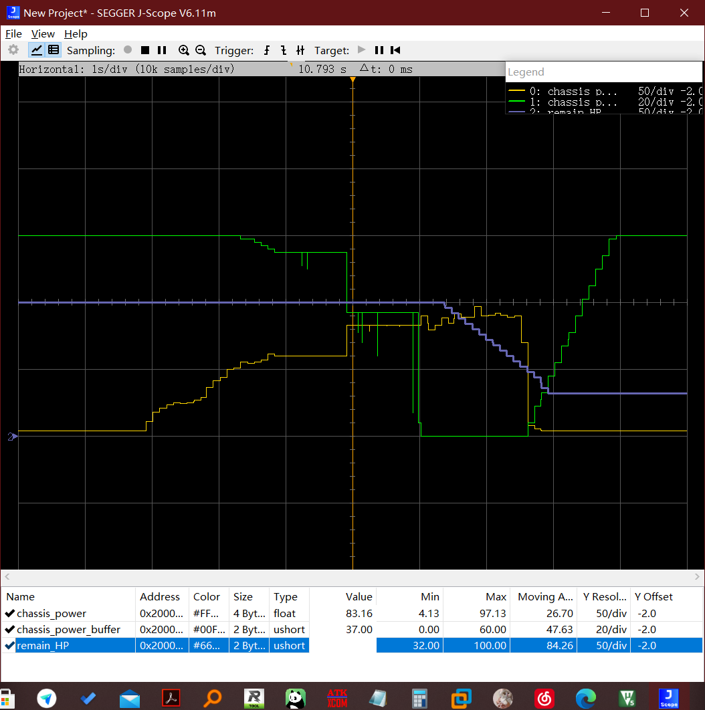
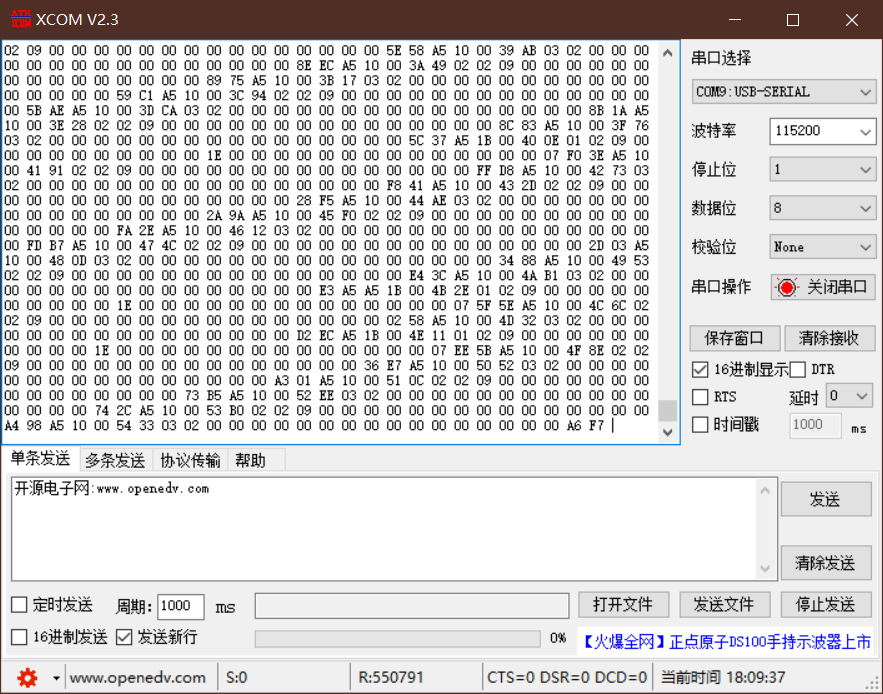
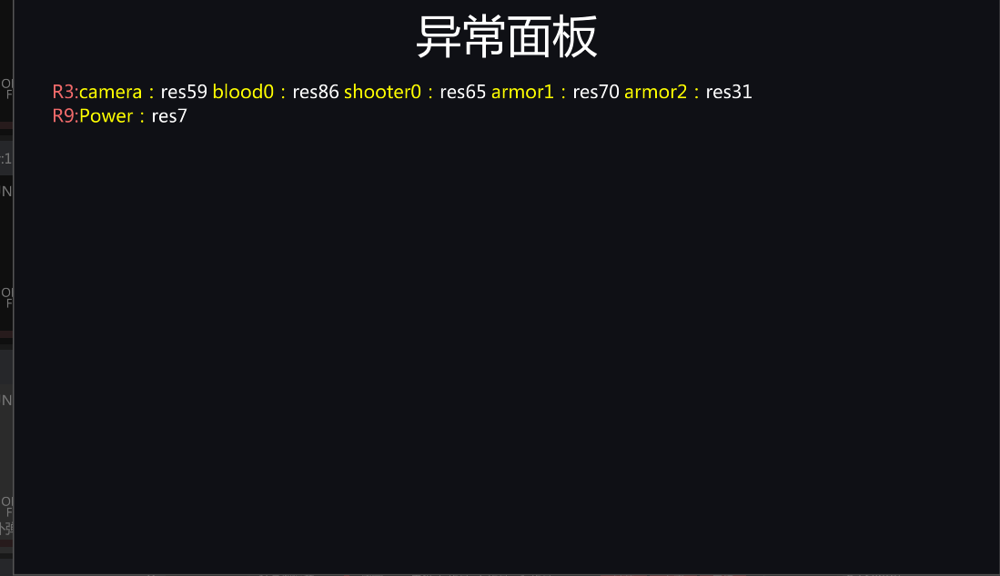
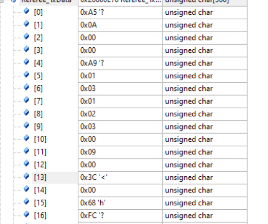

上图是crc校验结果和运算结果以及包序号的jscope图片，可以发现的是包序号基本没啥问题，但是crc校验结果几乎不变，考虑到可能是crc校验算法的锅，在线网站校验结果也不一致。所以这里单独把crc校验代码复制出来进行验证。

麻了，确实有问题


按照上述规则计算出来数值与传输数值一致，按照代码中计算始终为c6


还有比较痛苦的一点是即使我们忽略了校验头的错误，根据裁判系统协议，接下来应该是cmd_id，但是显然是没有0x0400这个cmd_id的，这里不确定到底是什么问题。

昨天猜测cmd_id是组网的问题，今天在组网以后，依旧是0400，偶尔冒出来一个0800


如图所示，绿色的依旧是包序号，可见包序号比较正常，黄色是cmd_id，会出现突起，然而这两种突起都是没有的，接下来尝试去刷一下裁判系统固件

啊，刷新完固件貌似好了

在服务器端发现了神奇的现象，功率检测变成了这个样子，先放着，目前不想重启，重启以后发现问题并没有消失


贴几个crc算法学习的网页

[crc算法学习](https://zhuanlan.zhihu.com/p/114049042)

可以开始冲dji了，还有ckb，抄代码的时候抄出问题了，查了好几天，dji也确实没给自己的代码加反转

破案了，dji没有锅，djicrc的代码没有问题，是我的问题

而且dji在传信息的时候考虑到stm32大小端的问题，在用的时候直接丢进去就行了。

包括所有的解码都要这么做，之前的一些数据长度啊啥的

最后关于包帧头的问题，暴力通过遍历解决了，效果目前看还不错，只能说f4性能真好（



这张图是测试了一下裁判系统传回的数据，绿色为缓冲能量，黄色为实时功率，紫色为生命值。


开始测裁判系统的机器人间通讯功能，在底盘的控制代码部分加入以下代码

```cpp
Referee_SendRobotCustomData(0x201,9,(uint8_t*)&Referee_RefereeData.chassis_power_buffer,2);
```

搭建起另一组裁判系统以及供电（顺带一提这里面的电源管理模块有问题），配置成兵种为雷达，通过uart转ttl模块接入至电脑，打开串口调试软件，可以正常收到消息。



接下来打开裁判系统服务器端，将两者接入服务器，可以在服务器中看到是电源管理模块损坏的log



在服务器上start比赛，在串口调试软件保存后，搜索机器人间通讯cmd_id 0301（这里记得要按照大小端相反搜索0103），并没有搜索到数据

怀疑是发送频率过高，加入以下代码，设置成一秒发送一次，小于30hz的带宽，再次测试，依旧收不到消息

```cpp
static int i = 0;
	if(i == 1000){
		Referee_SendRobotCustomData(0x201,9,(uint8_t*)&Referee_RefereeData.chassis_power_buffer,2);
		i = 0;
	}
	else i++;
```


在查看代码以后，发现是由于裁判系统的更新，导致加入了一些新的兵种，修改代码以后依旧接收不到

查看发送buff以后，发现数据格式不正常，查看代码以后发现是代码写的有问题，需要进行修改。

裁判系统这里用户通讯的协议应该是0x0301为cmd_id，然后再加上一段数据段

最后我认为应该是这样的数据格式是正确的。虽然测试了以后还是接受不到......


