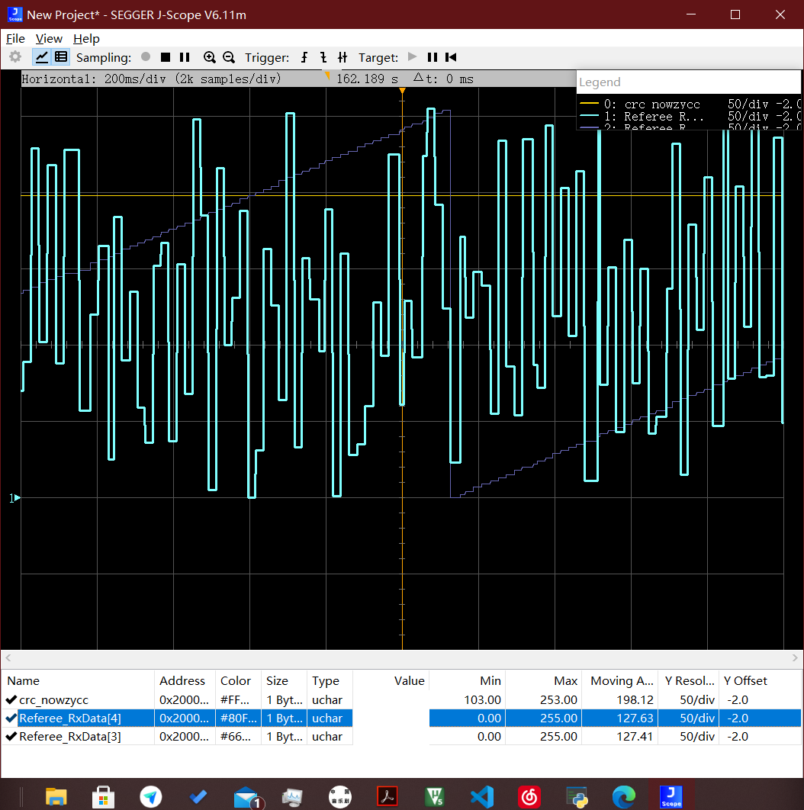
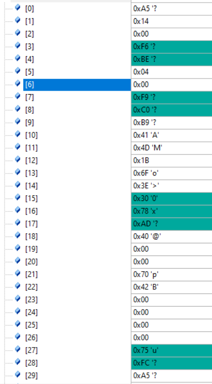
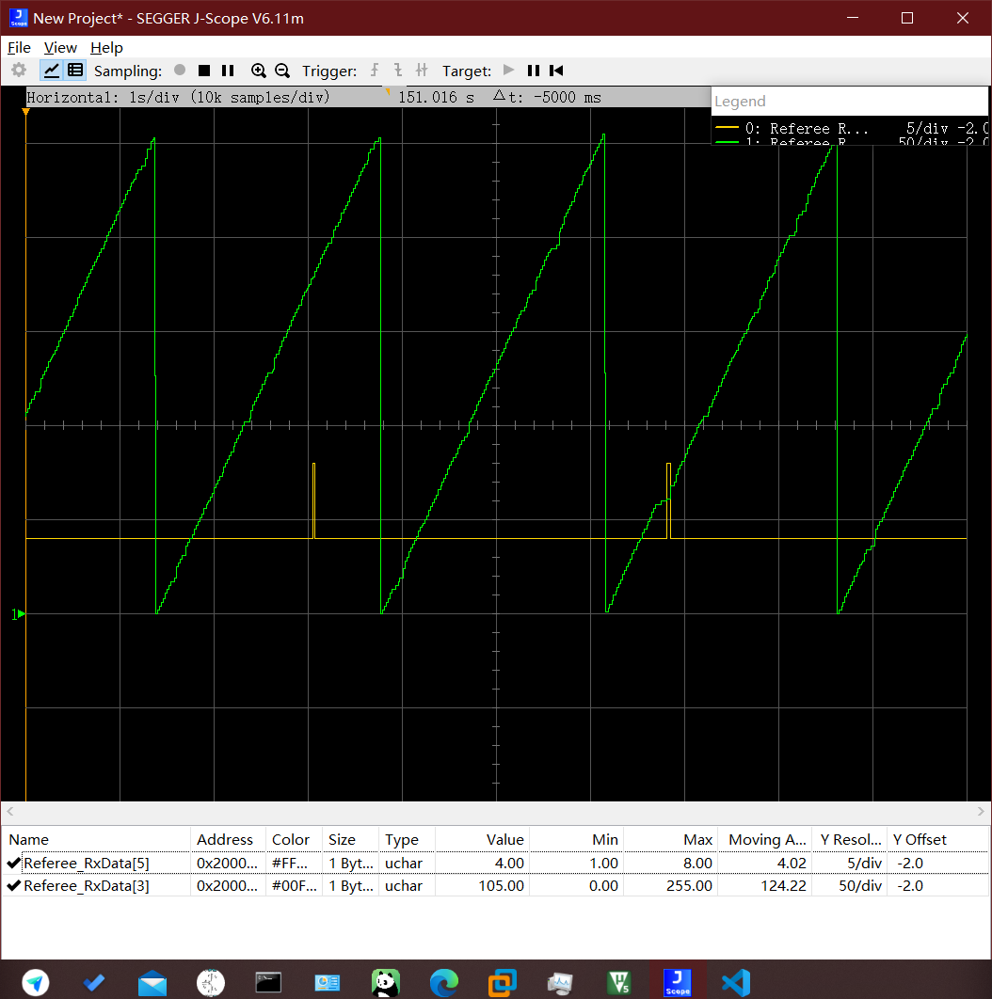
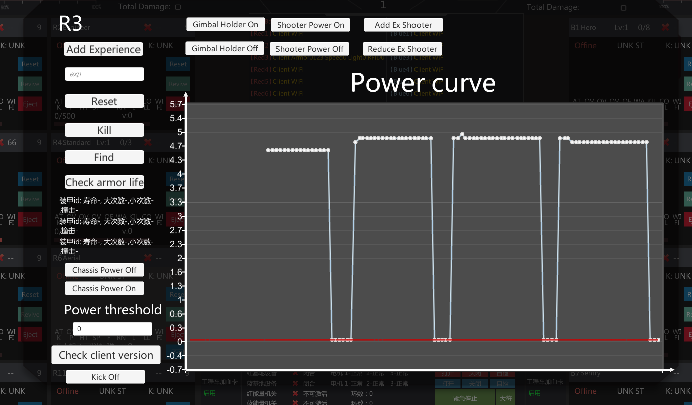

上图是crc校验结果和运算结果以及包序号的jscope图片，可以发现的是包序号基本没啥问题，但是crc校验结果几乎不变，考虑到可能是crc校验算法的锅，在线网站校验结果也不一致。所以这里单独把crc校验代码复制出来进行验证。

麻了，确实有问题

按照上述规则计算出来数值与传输数值一致，按照代码中计算始终为c6

还有比较痛苦的一点是即使我们忽略了校验头的错误，根据裁判系统协议，接下来应该是cmd_id，但是显然是没有0x0400这个cmd_id的，这里不确定到底是什么问题。

昨天猜测cmd_id是组网的问题，今天在组网以后，依旧是0400，偶尔冒出来一个0800

如图所示，绿色的依旧是包序号，可见包序号比较正常，黄色是cmd_id，会出现突起，然而这两种突起都是没有的，接下来尝试去刷一下裁判系统固件

啊，刷新完固件貌似好了

在服务器端发现了神奇的现象，功率检测变成了这个样子，先放着，目前不想重启，重启以后发现问题并没有消失

贴几个crc算法学习的网页

[crc算法学习](https://zhuanlan.zhihu.com/p/114049042)

可以开始冲dji了，还有ckb，抄代码的时候抄出问题了，查了好几天，dji也确实没给自己的代码加反转

破案了，dji没有锅，djicrc的代码没有问题，是我的问题

而且dji在传信息的时候考虑到stm32大小端的问题，在用的时候直接丢进去就行了。

包括所有的解码都要这么做，之前的一些数据长度啊啥的
